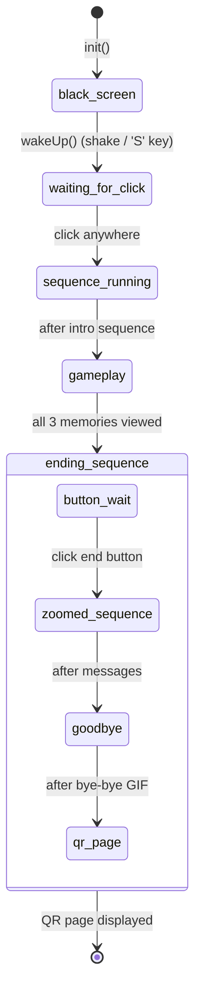
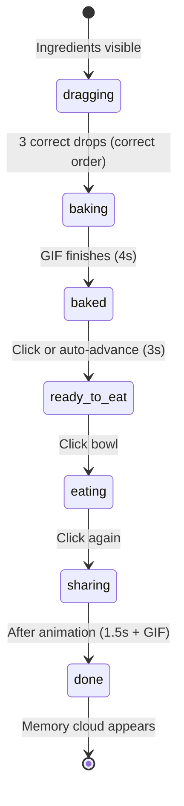

# Cryocare — Application Walkthrough

## 1. Overview & Concept

Cryocare is a **cultural-preservation interactive webapp** designed for a physical installation. Users "adopt" a digital guardian — a character representing an endangered or persecuted culture — and care for it through a series of gated activities: cooking a traditional dish, dressing the guardian in ceremonial attire, and performing a cultural ritual.

Each activity builds **trust** (visualised by a progress bar) and unlocks **memories** — poignant messages about why the guardian entered "cryoconservation". The experience ends with a goodbye sequence and a QR code linking to further content.

### Supported Cultures

The app ships with six culture profiles, each providing unique character names, food, clothing, rituals, and narrative text:

| Culture | Guardian | Traditional Dish |
|---|---|---|
| Kurdish | Rojan | Dolma |
| Amazigh | Meryem | Couscous |
| Maori | Kauri | Hangi |
| Palestinian | Ibrahim | Maqluba |
| Uyghur | Erkin | Laghman |
| Guarani | Araí | Sopa Paraguaya |

---

## 2. Architecture

### File Structure

```
webapp/
├── index.html              # Single-page shell with layered DOM
├── css/style.css           # All visual styling & animations
├── js/script.js            # Entire application logic (~1400 lines)
├── config/
│   ├── default.json        # Global config (assets, layout, rules, text templates)
│   └── cultures.json       # Per-culture overrides (variables, food order, correct dress)
└── assets/                 # Images, GIFs, audio (organised by culture)
```

### Firebase Integration

The app connects to a **Firebase Realtime Database** at startup. Two database paths are used:

| Path | Direction | Purpose |
|---|---|---|
| `device/culture` | **Read** (listener) | An external device (e.g. physical selector) writes a culture name here. The app listens via `onValue()` and calls `init(selectedCulture)` whenever the value changes, effectively resetting and restarting the experience for the selected culture. |
| `device/trigger` | **Write** | The app writes `true` to this path at key moments (wrong answer, ritual, goodbye) to signal a connected Arduino for physical feedback (vibration, lights, etc.). |

> [!NOTE]
> The Firebase config is hardcoded in [script.js](file:///Users/carmigab/Projects/app-gaia/Cryocare/webapp/js/script.js#L6-L14). The `onValue` listener on `device/culture` (line 23) is the app's entry point — every culture change triggers a full `init()`.

### Configuration System

Configuration is split into two JSON files loaded at startup:

- [default.json](file:///Users/carmigab/Projects/app-gaia/Cryocare/webapp/config/default.json) — Global settings: asset path templates, layout positions, UI thresholds, text templates, and default game rules.
- [cultures.json](file:///Users/carmigab/Projects/app-gaia/Cryocare/webapp/config/cultures.json) — Per-culture overrides. Each culture provides `VARIABLES` (template substitutions like `{petName}`, `{foodName}`) and `RULES` (correct food order and dress ID).

During `resetGame()`, the culture-specific `RULES` are merged on top of the default `CONFIG.RULES`, so each culture can define its own correct food sequence and dress.

### Asset Pipeline

Asset paths use **template placeholders** that are resolved at runtime:

- `{culture}` → replaced with the active culture key (e.g. `kurd`, `amazigh`)
- `{id}` → replaced with item IDs (dress number, memory index, etc.)

Example: `assets/{culture}/pet/dress{id}.png` → `assets/amazigh/pet/dress2.png`

The function [getAssetPath()](file:///Users/carmigab/Projects/app-gaia/Cryocare/webapp/js/script.js#L1164-L1166) handles `{culture}` substitution. Text templates are resolved by [getText()](file:///Users/carmigab/Projects/app-gaia/Cryocare/webapp/js/script.js#L1168-L1172), which replaces `{variableName}` tokens with values from the culture's `VARIABLES` object.

All culture-specific images are **preloaded** during `init()` via [collectCultureAssets()](file:///Users/carmigab/Projects/app-gaia/Cryocare/webapp/js/script.js#L188-L216) to prevent visible loading flicker during gameplay.

---

## 3. Application State Machine

The app's lifecycle is governed by the `state.appPhase` field. The full flow is strictly linear:



### Phase Details

#### `black_screen`
- **Visual**: Full-screen black overlay covers everything.
- **Transition**: Device shake (accelerometer), pressing `S`, or (originally) a tap calls `wakeUp()`.
- **Behaviour**: If the game was already started (`hasStarted === true`), skips straight to `gameplay`. Otherwise → `waiting_for_click`.

#### `waiting_for_click`
- **Visual**: Static loading image (egg/cocoon) displayed at intro Y position.
- **Transition**: Any click/tap on the body → `handleStartupSequence()`.

#### `sequence_running`
- **Sub-states** tracked by `state.loadingStep`:

| loadingStep | Duration | Visual |
|---|---|---|
| `static` | instant | Static loading image, fades out |
| `cloud_tap` | 3s | Cloud-tap instruction GIF |
| `welcome` | 3s | Wave animation + "Hello! Thank you for adopting me!" |
| `instructions` | 3s | Wave animation + "I'm {petName}, a {cultureName} Cultural Guardian" |

- Uses a **session token** pattern (`state.sessionToken`) to abort the async sequence if a new `init()` fires mid-sequence.
- Triggers hardware at the `welcome` step.

#### `gameplay`
- The main interactive phase. See **§4 Gameplay Loop** for full details.
- Transitions to `ending_sequence` when the user closes the **dress memory** overlay (the last memory in the chain).

#### `ending_sequence`
- **Sub-states** tracked by `state.endingStep`:

| endingStep | Description |
|---|---|
| `button_wait` | Bouncing end-button (cloud) appears at the top. Waits for user click. |
| `zoomed_sequence` | Pet zooms in. Two culture-specific narrative messages display sequentially (5s each). |
| `goodbye` | Pet zooms out. Bye-bye GIF plays. Hardware triggered. |
| `qr_page` | Final screen: QR code image + "Log in to the app" / "View what you learned today". QR variant is chosen based on memory/undress state. |

---

## 4. Gameplay Loop

Gameplay consists of **three gated activities** that must be completed in order. Each activity occupies one of three **pages** defined in the `PAGES` array:

| Index | Page ID | Content | Interaction |
|---|---|---|---|
| 0 | `home` | Empty (just the pet) | View home memory |
| 1 | `food` | 3 draggable ingredient buttons | Drag-to-bowl in correct order |
| 2 | `dress` | 3 draggable outfit buttons | Drag-to-pet to dress |

### Gating Logic

Activities unlock sequentially. The system determines the "global next step" in [evaluateTopButton()](file:///Users/carmigab/Projects/app-gaia/Cryocare/webapp/js/script.js#L317-L401):

```
Food not done? → next step is "food"
Food done but Dress not done? → next step is "dress"  
Dress done but Ritual not done? → next step is "ritual"
```

However, cloud buttons only appear **after the preceding memory has been viewed**:
- Food cloud appears after home memory is viewed
- Dress cloud appears after food memory is viewed  
- Ritual cloud appears immediately (on any page) once dress is done

### Food Activity (Page 1)

The food interaction is a **multi-phase sequence**:



1. **Ingredient Selection**: Three food buttons arranged in an arc. User drags them to the center (pet/bowl). Each must match the culture's `CORRECT_FOOD_ORDER` sequentially. Wrong order → hardware trigger (vibration) + button snaps back.
2. **Baking**: A cooking GIF plays for `GIF_DURATION_MS` (4s). "Cooking..." text appears.
3. **Baked**: Food name and description appear. After 3 seconds (or a click) the bowl fills.
4. **Feeding**: Three sequential clicks advance through `ready_to_eat` → `eating` (bowl animates, food reduces) → `sharing` (bowl moves toward user, pet does a jump animation) → `done`.
5. `state.progress.food` is set to `true` during the `eating` phase.

### Dress Activity (Page 2)

1. Three outfit buttons displayed in an arc. User drags one to the center.
2. Any dress is accepted visually — the pet image changes to `dress{id}.png`.
3. Only the culture's `CORRECT_DRESS_ID` sets `state.progress.dress = true`. Wrong choices trigger hardware feedback.
4. **Undress Mechanic**: If the user taps near the center of the pet while dressed, a reverse-drag sequence starts. Dragging the spawned dress button more than 80px from center removes the dress, resets `progress.dress` and `progress.ritual`, and marks `hasBeenUndressed = true` (affects QR code variant at the end).

### Ritual Activity (No dedicated page)

The ritual is not a separate page — it's triggered via a cloud button that can appear on **any page** once dress progress is complete:

1. User taps the ritual cloud → navigates to dress page (if not already there) and calls [triggerRitual()](file:///Users/carmigab/Projects/app-gaia/Cryocare/webapp/js/script.js#L1060-L1092).
2. A culture-specific ritual GIF plays + culture-specific audio (`ritual_{culture}.mov`).
3. Hardware is triggered.
4. After `GIF_DURATION_MS`, the animation ends and `state.progress.ritual = true`.
5. The dress memory cloud then appears.

---

## 5. Memory & Progression System

### Memories

Memories are **reward images** unlocked at specific milestones. They appear as clickable cloud buttons in the top content zone with a timed delay:

| Memory | Page | Unlock Condition | Delay |
|---|---|---|---|
| Home (1) | `home` | Immediately at gameplay start | Fixed 3s |
| Food (2) | `food` | After full baking + feeding sequence is `done` | Random 1–3s |
| Dress (3) | `dress` | After ritual animation completes | Random 1–3s |

**Viewing flow:**
1. Cloud button appears (with bubble sound).
2. User taps → memory overlay opens with a brief opening GIF (0.5s), then the actual memory image.
3. User taps anywhere → overlay closes, `memoriesViewed[pageId]` is set to `true`.
4. Closing the dress memory (the last one) triggers `startEndingPhase()`.

### Progress Bar

A 3-step visual progress bar at the top of the screen tracks completed activities:

- Score increments when `progress.food`, `progress.dress`, or `progress.ritual` become `true`.
- Each increment plays a brief GIF animation (`bar_{score}.gif`) with a trust sound effect, then settles to a static PNG (`bar_{score}.png`).
- Hidden during non-gameplay phases.

### Ending QR Code Variants

The final QR code image is dynamically selected based on two boolean flags, producing four possible combinations:

| Memory Seen? | Undressed? | File |
|---|---|---|
| No | No | `qr_code.png` |
| Yes | No | `qr_code_mem.png` |
| No | Yes | `qr_code_naked.png` |
| Yes | Yes | `qr_code_mem_naked.png` |

This is determined in [updateImages()](file:///Users/carmigab/Projects/app-gaia/Cryocare/webapp/js/script.js#L479-L501) when `endingStep === 'qr_page'`.

---

## 6. UI & Interaction Layer

### DOM Layer Architecture

The HTML uses a single oval container (`#oval-container`) with content organised into z-index layers:

| Layer | z-index | Elements |
|---|---|---|
| 1 — Actors | 10 | Pet image |
| 2 — Props | 30–35 | Table, Bowl |
| 3 — UI Content | 40 | Top/Bottom text zones |
| 4 — Controls | 50 | Progress bar, nav arrows, buttons, info button |
| 5 — Overlays | 100–250 | Black screen, info overlay, memory overlay |

### Drag-and-Drop System

Implemented in [setupDragAndDrop()](file:///Users/carmigab/Projects/app-gaia/Cryocare/webapp/js/script.js#L892-L994) with **hybrid pointer + touch** events for iOS 12 compatibility:

1. **Start**: On `pointerdown`/`touchstart`, the button is detached from its container and re-appended to `document.body` with `position: fixed`. A drag sound plays.
2. **Move**: `pointermove`/`touchmove` update the element's transform. `preventDefault()` is called to block iOS scroll/bounce.
3. **End**: On release, distance from screen center is calculated. If < 180px → `onDropCallback()` fires (success). If the callback returns `false` or distance is too far, the button animates back to its original position.

A global `state.ui.isAnyButtonDragging` flag prevents multiple simultaneous drags.

### Cloud Button System

Cloud buttons (food, dress, ritual, memory) are managed by [evaluateTopButton()](file:///Users/carmigab/Projects/app-gaia/Cryocare/webapp/js/script.js#L317-L401):

- Only one cloud type can be active at a time (`state.ui.topButton.activeType`).
- When the desired type changes, the old timer is cleared and a new delayed reveal is scheduled (except ritual clouds, which appear immediately).
- A bubble sound plays when the cloud becomes visible.
- Clouds are suppressed during GIF animations (`isGifPlaying`).

### Navigation

Navigation between pages is currently **disabled** — arrows are force-hidden (`hideArrows = true` at [line 588](file:///Users/carmigab/Projects/app-gaia/Cryocare/webapp/js/script.js#L588)). Page transitions are driven entirely by cloud button taps, which set `state.currentPageIndex` directly.

The underlying navigation system still exists:
- **Arrow buttons**: Left/right, locked based on `state.unlocked.food/dress`.
- **Swipe**: Touch swipe on the oval container with a 150px threshold.
- **Page locking**: Pages 1 and 2 require explicit unlock via cloud interaction.

### Overlays

| Overlay | Trigger | Close |
|---|---|---|
| **Black Screen** | Init / inactivity timeout | `wakeUp()` (shake / 'S' key) |
| **Info** | Info button tap (ℹ️) | Tap anywhere on overlay |
| **Memory** | Memory cloud tap | Tap anywhere (marks memory as viewed) |

### Rendering Pipeline

Every state change calls [updateUI()](file:///Users/carmigab/Projects/app-gaia/Cryocare/webapp/js/script.js#L309-L315), which orchestrates five sub-functions:

1. `evaluateTopButton()` — Determine which cloud (if any) should appear
2. `applyLayoutPositions()` — Set Y-positions of all elements based on `CONFIG.LAYOUT`
3. `updateImages()` — Resolve pet image, progress bar, table/bowl visibility and state
4. `updateControls()` — Show/hide arrows, render info button, call `renderButtons()`
5. `updateContentZones()` — Populate top/bottom text zones with appropriate content

---

## 7. Hardware Integration

The app communicates with a physical Arduino device via Firebase Realtime Database:

### Inbound: Culture Selection
```
Firebase path: device/culture
Direction:     Device → App
```
An external physical selector writes a culture string (e.g. `"kurd"`) to this path. The app's `onValue` listener detects the change and calls `init(selectedCulture)`, fully resetting and restarting the experience.

### Outbound: Trigger Signal
```
Firebase path: device/trigger  
Direction:     App → Device
```
The app writes `true` to this path via [triggerHardware()](file:///Users/carmigab/Projects/app-gaia/Cryocare/webapp/js/script.js#L1206-L1214) at these moments:

| Event | Purpose |
|---|---|
| Wrong food ingredient dropped | Negative feedback (vibration/shake) |
| Wrong dress selected | Negative feedback |
| Ritual starts | Physical accompaniment |
| Startup welcome step | Wake-up signal |
| Undress initiated | Feedback |
| Goodbye/bye-bye animation | Final farewell effect |

> [!NOTE]
> The inactivity timeout (`TIMEOUT_MS: 80000`) that would return to `black_screen` is currently **commented out** in [resetInactivityTimer()](file:///Users/carmigab/Projects/app-gaia/Cryocare/webapp/js/script.js#L1216-L1225).

---

## 8. Audio System

All sounds are pre-instantiated as `Audio` objects at module scope:

| Sound | File | Volume | Trigger |
|---|---|---|---|
| Click | `click_sound.mp3` | 0.5 | Any button press (via `animateButtonPress`) |
| Info | `interazione/info.mp3` | 0.5 | Info button tap |
| Bowl | `interazione/ciotola.mp3` | 0.5 | Each feeding phase click |
| Trust/Progress | `interazione/trust.mp3` | 0.6 | Progress bar increment |
| Memory Opening | `interazione/apertura_ricordo.mov` | 0.5 | Memory cloud tap |
| Bubble Appear | `interazione/appear_nuvola.mp3` | 0.5 | Cloud button becomes visible |
| Drag Start | `interazione/swipe.mp3` | 0.5 | Drag interaction begins |
| Ritual *(dynamic)* | `audio/rito/ritual_{culture}.mov` | 0.6 | Ritual animation — unique per culture |

> [!TIP]
> Ritual audio is the only sound created dynamically (in `triggerRitual()`). It is explicitly paused and reset when the ritual GIF finishes to prevent audio bleeding into the next interaction.
