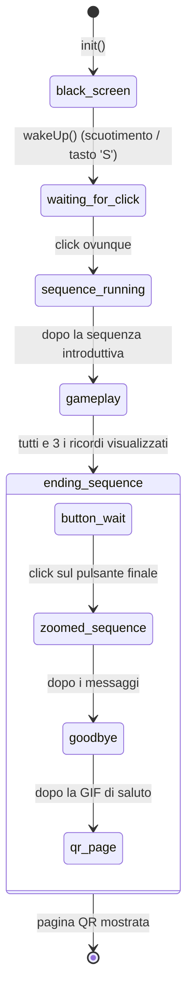
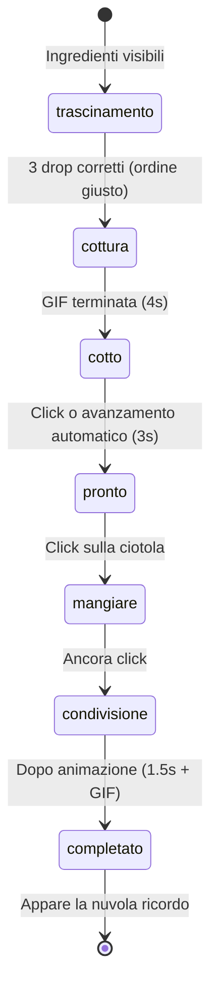

# Cryocare — Walkthrough Tecnico dell'Applicazione

## 1. Panoramica e Concetto

Cryocare è una **web app interattiva pensata per la conservazione culturale**, progettata per funzionare all'interno di un'installazione fisica. L'utente "adotta" un guardiano digitale — un personaggio che rappresenta una cultura in pericolo o perseguitata — e se ne prende cura attraverso una serie di attività guidate: cucinare un piatto tradizionale, vestire il guardiano con l'abito cerimoniale e assistere a un rituale culturale.

Ogni attività costruisce **fiducia** (visualizzata da una barra di progresso) e sblocca dei **ricordi** — messaggi toccanti che spiegano perché il guardiano è entrato in "crioconservazione". L'esperienza si conclude con una sequenza di saluto e un codice QR che rimanda a contenuti di approfondimento.

### Culture Supportate

L'app include sei profili culturali, ognuno con nomi, cibi, abiti, rituali e testi narrativi unici:

| Cultura | Guardiano | Piatto Tradizionale |
|---|---|---|
| Curda | Rojan | Dolma |
| Amazigh | Meryem | Couscous |
| Maori | Kauri | Hangi |
| Palestinese | Ibrahim | Maqluba |
| Uigura | Erkin | Laghman |
| Guaraní | Araí | Sopa Paraguaya |

---

## 2. Architettura

### Struttura dei File

```
webapp/
├── index.html              # Pagina singola con DOM a livelli
├── css/style.css           # Tutti gli stili visivi e le animazioni
├── js/script.js            # Tutta la logica applicativa (~1400 righe)
├── config/
│   ├── default.json        # Configurazione globale (asset, layout, regole, template di testo)
│   └── cultures.json       # Override per cultura (variabili, ordine ingredienti, vestito corretto)
└── assets/                 # Immagini, GIF, audio (organizzati per cultura)
```

### Integrazione Firebase

L'app si connette a un **Firebase Realtime Database** all'avvio. Vengono utilizzati due percorsi nel database:

| Percorso | Direzione | Scopo |
|---|---|---|
| `device/culture` | **Lettura** (listener) | Un dispositivo esterno (es. un selettore fisico) scrive qui il nome della cultura. L'app resta in ascolto tramite `onValue()` e chiama `init(selectedCulture)` a ogni cambiamento, resettando e riavviando completamente l'esperienza per la cultura selezionata. |
| `device/trigger` | **Scrittura** | L'app scrive `true` su questo percorso nei momenti chiave (risposta sbagliata, rituale, saluto finale) per segnalare a un Arduino collegato di produrre feedback fisico (vibrazioni, luci, ecc.). |

> [!NOTE]
> La configurazione Firebase è scritta direttamente nel codice di [script.js](file:///Users/carmigab/Projects/app-gaia/Cryocare/webapp/js/script.js#L6-L14). Il listener su `device/culture` (riga 23) è il punto di ingresso dell'app — ogni cambio di cultura avvia un nuovo ciclo completo di `init()`.

### Sistema di Configurazione

La configurazione è suddivisa in due file JSON caricati all'avvio:

- [default.json](file:///Users/carmigab/Projects/app-gaia/Cryocare/webapp/config/default.json) — Impostazioni globali: percorsi degli asset, posizioni di layout, soglie dell'interfaccia, template di testo e regole di gioco predefinite.
- [cultures.json](file:///Users/carmigab/Projects/app-gaia/Cryocare/webapp/config/cultures.json) — Override per cultura. Ogni cultura fornisce `VARIABLES` (sostituzioni nei template come `{petName}`, `{foodName}`) e `RULES` (ordine corretto degli ingredienti e ID del vestito giusto).

Durante il `resetGame()`, le `RULES` specifiche della cultura vengono sovrapposte alle `CONFIG.RULES` di default, permettendo a ogni cultura di definire la propria sequenza di ingredienti e il proprio vestito corretto.

### Pipeline degli Asset

I percorsi degli asset usano **segnaposto** che vengono sostituiti a runtime:

- `{culture}` → sostituito con la chiave della cultura attiva (es. `kurd`, `amazigh`)
- `{id}` → sostituito con l'identificativo dell'elemento (numero del vestito, indice del ricordo, ecc.)

Esempio: `assets/{culture}/pet/dress{id}.png` → `assets/amazigh/pet/dress2.png`

La funzione [getAssetPath()](file:///Users/carmigab/Projects/app-gaia/Cryocare/webapp/js/script.js#L1164-L1166) gestisce la sostituzione di `{culture}`. I template di testo vengono risolti da [getText()](file:///Users/carmigab/Projects/app-gaia/Cryocare/webapp/js/script.js#L1168-L1172), che sostituisce i token `{nomeVariabile}` con i valori dell'oggetto `VARIABLES` della cultura.

Tutte le immagini specifiche della cultura vengono **precaricate** durante `init()` tramite [collectCultureAssets()](file:///Users/carmigab/Projects/app-gaia/Cryocare/webapp/js/script.js#L188-L216) per evitare sfarfallii visibili durante il gioco.

---

## 3. Macchina a Stati dell'Applicazione

Il ciclo di vita dell'app è governato dal campo `state.appPhase`. Il flusso è strettamente lineare:



### Dettaglio delle Fasi

#### `black_screen`
- **Visuale**: Overlay nero a schermo intero che copre tutto.
- **Transizione**: Scuotimento del dispositivo (accelerometro), pressione del tasto `S`, oppure (originariamente) un tap chiama `wakeUp()`.
- **Comportamento**: Se il gioco era già stato avviato (`hasStarted === true`), salta direttamente al `gameplay`. Altrimenti → `waiting_for_click`.

#### `waiting_for_click`
- **Visuale**: Immagine statica di caricamento (uovo/bozzolo) nella posizione Y di introduzione.
- **Transizione**: Qualsiasi click/tap sul body → `handleStartupSequence()`.

#### `sequence_running`
- **Sotto-stati** tracciati da `state.loadingStep`:

| loadingStep | Durata | Visuale |
|---|---|---|
| `static` | istantaneo | Immagine statica, dissolvenza in uscita |
| `cloud_tap` | 3s | GIF istruttiva sul tocco delle nuvole |
| `welcome` | 3s | Animazione onda + "Hello! Thank you for adopting me!" |
| `instructions` | 3s | Animazione onda + "I'm {petName}, a {cultureName} Cultural Guardian" |

- Utilizza un pattern di **session token** (`state.sessionToken`) per interrompere la sequenza asincrona se un nuovo `init()` viene lanciato a metà esecuzione.
- Attiva l'hardware durante lo step `welcome`.

#### `gameplay`
- La fase interattiva principale. Vedi **§4 Ciclo di Gioco** per i dettagli.
- Transita verso `ending_sequence` quando l'utente chiude l'overlay del **ricordo del vestito** (l'ultimo ricordo della catena).

#### `ending_sequence`
- **Sotto-stati** tracciati da `state.endingStep`:

| endingStep | Descrizione |
|---|---|
| `button_wait` | Compare un pulsante finale con animazione a rimbalzo. Attende il click dell'utente. |
| `zoomed_sequence` | Il pet fa uno zoom in. Due messaggi narrativi specifici della cultura vengono mostrati in sequenza (5s ciascuno). |
| `goodbye` | Il pet torna alla dimensione normale. Si riproduce la GIF di saluto. L'hardware viene attivato. |
| `qr_page` | Schermata finale: codice QR + "Log in to the app" / "View what you learned today". La variante del QR dipende dallo stato ricordo/svestizione. |

---

## 4. Ciclo di Gioco

Il gameplay è composto da **tre attività sequenziali** che devono essere completate in ordine. Ogni attività occupa una delle tre **pagine** definite nell'array `PAGES`:

| Indice | ID Pagina | Contenuto | Interazione |
|---|---|---|---|
| 0 | `home` | Vuota (solo il pet) | Visualizzare il ricordo iniziale |
| 1 | `food` | 3 pulsanti ingrediente trascinabili | Trascinare nella ciotola nell'ordine corretto |
| 2 | `dress` | 3 pulsanti abito trascinabili | Trascinare sul pet per vestirlo |

### Logica di Sbloccamento

Le attività si sbloccano in sequenza. Il sistema determina il "prossimo passo globale" in [evaluateTopButton()](file:///Users/carmigab/Projects/app-gaia/Cryocare/webapp/js/script.js#L317-L401):

```
Cibo non completato? → prossimo passo è "food"
Cibo fatto ma Vestito no? → prossimo passo è "dress"
Vestito fatto ma Rituale no? → prossimo passo è "ritual"
```

Tuttavia, i pulsanti nuvola appaiono solo **dopo che il ricordo precedente è stato visualizzato**:
- La nuvola del cibo appare dopo aver visto il ricordo iniziale
- La nuvola del vestito appare dopo aver visto il ricordo del cibo
- La nuvola del rituale appare immediatamente (su qualsiasi pagina) una volta completato il vestito

### Attività Cibo (Pagina 1)

L'interazione del cibo è una **sequenza a più fasi**:



1. **Selezione Ingredienti**: Tre pulsanti disposti ad arco. L'utente li trascina al centro (pet/ciotola). Ciascuno deve corrispondere al `CORRECT_FOOD_ORDER` della cultura in sequenza. Ordine sbagliato → attivazione hardware (vibrazione) + il pulsante torna alla posizione originale.
2. **Cottura**: Una GIF di cottura viene riprodotta per `GIF_DURATION_MS` (4s). Appare il testo "Cooking...".
3. **Cotto**: Appaiono nome e descrizione del piatto. Dopo 3 secondi (o un click) la ciotola si riempie.
4. **Alimentazione**: Tre click sequenziali avanzano attraverso `ready_to_eat` → `eating` (la ciotola si anima, il cibo diminuisce) → `sharing` (la ciotola si muove verso l'utente, il pet salta) → `done`.
5. `state.progress.food` viene impostato a `true` durante la fase `eating`.

### Attività Vestito (Pagina 2)

1. Tre pulsanti abito disposti ad arco. L'utente ne trascina uno al centro.
2. Qualsiasi vestito viene accettato visivamente — l'immagine del pet cambia in `dress{id}.png`.
3. Solo il `CORRECT_DRESS_ID` della cultura imposta `state.progress.dress = true`. Le scelte sbagliate attivano il feedback hardware.
4. **Meccanica di Svestizione**: Se l'utente tocca il centro del pet mentre è vestito, parte una sequenza di trascinamento inverso. Trascinare il pulsante del vestito a più di 80px dal centro rimuove il vestito, resetta `progress.dress` e `progress.ritual`, e segna `hasBeenUndressed = true` (influenza la variante del QR finale).

### Attività Rituale (Nessuna pagina dedicata)

Il rituale non ha una pagina propria — viene attivato tramite un pulsante nuvola che può apparire su **qualsiasi pagina** una volta completato il progresso del vestito:

1. L'utente tocca la nuvola del rituale → naviga alla pagina del vestito (se non è già lì) e chiama [triggerRitual()](file:///Users/carmigab/Projects/app-gaia/Cryocare/webapp/js/script.js#L1060-L1092).
2. Viene riprodotta una GIF del rituale specifica della cultura + audio culturale (`ritual_{culture}.mov`).
3. L'hardware viene attivato.
4. Dopo `GIF_DURATION_MS`, l'animazione termina e `state.progress.ritual = true`.
5. Appare la nuvola del ricordo del vestito.

---

## 5. Sistema di Ricordi e Progressione

### Ricordi

I ricordi sono **immagini premio** sbloccate al raggiungimento di specifici traguardi. Appaiono come pulsanti nuvola cliccabili nella zona di contenuto superiore, con un ritardo temporizzato:

| Ricordo | Pagina | Condizione di Sblocco | Ritardo |
|---|---|---|---|
| Casa (1) | `home` | Immediatamente all'inizio del gameplay | 3s fissi |
| Cibo (2) | `food` | Dopo il completamento della sequenza cottura + alimentazione | Casuale 1–3s |
| Vestito (3) | `dress` | Dopo il completamento dell'animazione del rituale | Casuale 1–3s |

**Flusso di visualizzazione:**
1. Il pulsante nuvola appare (con suono di bolla).
2. L'utente tocca → si apre l'overlay del ricordo con una breve GIF di apertura (0.5s), poi l'immagine vera e propria.
3. L'utente tocca ovunque → l'overlay si chiude, `memoriesViewed[pageId]` viene impostato a `true`.
4. Chiudere il ricordo del vestito (l'ultimo) attiva `startEndingPhase()`.

### Barra di Progresso

Una barra di progresso a 3 passi nella parte alta dello schermo tiene traccia delle attività completate:

- Il punteggio aumenta quando `progress.food`, `progress.dress` o `progress.ritual` diventano `true`.
- Ogni incremento riproduce una breve animazione GIF (`bar_{punteggio}.gif`) con un effetto sonoro di fiducia, poi si stabilizza su un PNG statico (`bar_{punteggio}.png`).
- Nascosta durante le fasi non di gameplay.

### Varianti del Codice QR Finale

L'immagine QR finale viene selezionata dinamicamente in base a due flag booleani, producendo quattro combinazioni possibili:

| Ricordo Visto? | Svestito? | File |
|---|---|---|
| No | No | `qr_code.png` |
| Sì | No | `qr_code_mem.png` |
| No | Sì | `qr_code_naked.png` |
| Sì | Sì | `qr_code_mem_naked.png` |

Questo viene determinato in [updateImages()](file:///Users/carmigab/Projects/app-gaia/Cryocare/webapp/js/script.js#L479-L501) quando `endingStep === 'qr_page'`.

---

## 6. Interfaccia e Livello di Interazione

### Architettura dei Livelli DOM

L'HTML utilizza un unico contenitore ovale (`#oval-container`) con il contenuto organizzato in livelli z-index:

| Livello | z-index | Elementi |
|---|---|---|
| 1 — Attori | 10 | Immagine del pet |
| 2 — Oggetti | 30–35 | Tavolo, Ciotola |
| 3 — Contenuto UI | 40 | Zone di testo superiore/inferiore |
| 4 — Controlli | 50 | Barra progresso, frecce navigazione, pulsanti, pulsante info |
| 5 — Overlay | 100–250 | Schermo nero, overlay info, overlay ricordo |

### Sistema Drag-and-Drop

Implementato in [setupDragAndDrop()](file:///Users/carmigab/Projects/app-gaia/Cryocare/webapp/js/script.js#L892-L994) con eventi **ibridi pointer + touch** per compatibilità con iOS 12:

1. **Inizio**: Su `pointerdown`/`touchstart`, il pulsante viene staccato dal suo contenitore e riagganciato al `document.body` con `position: fixed`. Viene riprodotto un suono di trascinamento.
2. **Movimento**: `pointermove`/`touchmove` aggiornano la trasformazione dell'elemento. Viene chiamato `preventDefault()` per bloccare lo scroll/rimbalzo su iOS.
3. **Fine**: Al rilascio, viene calcolata la distanza dal centro dello schermo. Se < 180px → viene eseguita la `onDropCallback()` (successo). Se il callback restituisce `false` o la distanza è troppo grande, il pulsante torna con un'animazione alla posizione originale.

Un flag globale `state.ui.isAnyButtonDragging` impedisce trascinamenti multipli simultanei.

### Sistema Pulsanti Nuvola

I pulsanti nuvola (cibo, vestito, rituale, ricordo) sono gestiti da [evaluateTopButton()](file:///Users/carmigab/Projects/app-gaia/Cryocare/webapp/js/script.js#L317-L401):

- Solo un tipo di nuvola può essere attivo alla volta (`state.ui.topButton.activeType`).
- Quando il tipo desiderato cambia, il vecchio timer viene cancellato e viene programmata una nuova comparsa ritardata (eccetto le nuvole del rituale, che appaiono immediatamente).
- Viene riprodotto un suono di bolla quando la nuvola diventa visibile.
- Le nuvole vengono soppresse durante le animazioni GIF (`isGifPlaying`).

### Navigazione

La navigazione tra le pagine è attualmente **disabilitata** — le frecce sono forzatamente nascoste (`hideArrows = true` alla [riga 588](file:///Users/carmigab/Projects/app-gaia/Cryocare/webapp/js/script.js#L588)). Le transizioni tra pagine sono interamente guidate dai tap sulle nuvole, che impostano direttamente `state.currentPageIndex`.

Il sistema di navigazione sottostante esiste ancora:
- **Frecce**: Sinistra/destra, bloccate in base a `state.unlocked.food/dress`.
- **Swipe**: Gesto di scorrimento sul contenitore ovale con soglia di 150px.
- **Blocco pagine**: Le pagine 1 e 2 richiedono uno sblocco esplicito tramite interazione con le nuvole.

### Overlay

| Overlay | Attivazione | Chiusura |
|---|---|---|
| **Schermo Nero** | Init / timeout inattività | `wakeUp()` (scuotimento / tasto 'S') |
| **Info** | Tap sul pulsante info (ℹ️) | Tap ovunque sull'overlay |
| **Ricordo** | Tap sulla nuvola ricordo | Tap ovunque (segna il ricordo come visto) |

### Pipeline di Rendering

Ogni cambio di stato chiama [updateUI()](file:///Users/carmigab/Projects/app-gaia/Cryocare/webapp/js/script.js#L309-L315), che orchestra cinque sotto-funzioni:

1. `evaluateTopButton()` — Determina quale nuvola (se presente) deve apparire
2. `applyLayoutPositions()` — Imposta le posizioni Y di tutti gli elementi in base a `CONFIG.LAYOUT`
3. `updateImages()` — Risolve l'immagine del pet, la barra di progresso, la visibilità e lo stato di tavolo/ciotola
4. `updateControls()` — Mostra/nasconde le frecce, renderizza il pulsante info, chiama `renderButtons()`
5. `updateContentZones()` — Popola le zone di testo superiore/inferiore con il contenuto appropriato

---

## 7. Integrazione Hardware

L'app comunica con un dispositivo Arduino fisico tramite Firebase Realtime Database:

### In Entrata: Selezione Cultura
```
Percorso Firebase: device/culture
Direzione:        Dispositivo → App
```
Un selettore fisico esterno scrive una stringa di cultura (es. `"kurd"`) su questo percorso. Il listener `onValue` dell'app rileva il cambiamento e chiama `init(selectedCulture)`, resettando e riavviando completamente l'esperienza.

### In Uscita: Segnale di Attivazione
```
Percorso Firebase: device/trigger
Direzione:        App → Dispositivo
```
L'app scrive `true` su questo percorso tramite [triggerHardware()](file:///Users/carmigab/Projects/app-gaia/Cryocare/webapp/js/script.js#L1206-L1214) in questi momenti:

| Evento | Scopo |
|---|---|
| Ingrediente sbagliato trascinato | Feedback negativo (vibrazione) |
| Vestito sbagliato selezionato | Feedback negativo |
| Inizio rituale | Accompagnamento fisico |
| Step di benvenuto all'avvio | Segnale di risveglio |
| Avvio svestizione | Feedback |
| Animazione di saluto/bye-bye | Effetto di commiato finale |

> [!NOTE]
> Il timeout di inattività (`TIMEOUT_MS: 80000`) che riporterebbe allo schermo nero è attualmente **commentato** in [resetInactivityTimer()](file:///Users/carmigab/Projects/app-gaia/Cryocare/webapp/js/script.js#L1216-L1225).

---

## 8. Sistema Audio

Tutti i suoni sono pre-istanziati come oggetti `Audio` a livello di modulo:

| Suono | File | Volume | Attivazione |
|---|---|---|---|
| Click | `click_sound.mp3` | 0.5 | Qualsiasi pressione di pulsante (tramite `animateButtonPress`) |
| Info | `interazione/info.mp3` | 0.5 | Tap sul pulsante info |
| Ciotola | `interazione/ciotola.mp3` | 0.5 | Ogni click della fase di alimentazione |
| Fiducia/Progresso | `interazione/trust.mp3` | 0.6 | Incremento barra di progresso |
| Apertura Ricordo | `interazione/apertura_ricordo.mov` | 0.5 | Tap sulla nuvola ricordo |
| Comparsa Bolla | `interazione/appear_nuvola.mp3` | 0.5 | Quando un pulsante nuvola diventa visibile |
| Inizio Trascinamento | `interazione/swipe.mp3` | 0.5 | Inizio interazione di trascinamento |
| Rituale *(dinamico)* | `audio/rito/ritual_{culture}.mov` | 0.6 | Animazione del rituale — unico per cultura |

> [!TIP]
> L'audio del rituale è l'unico suono creato dinamicamente (in `triggerRitual()`). Viene esplicitamente fermato e riportato all'inizio quando la GIF del rituale finisce, per evitare che l'audio si sovrapponga all'interazione successiva.
